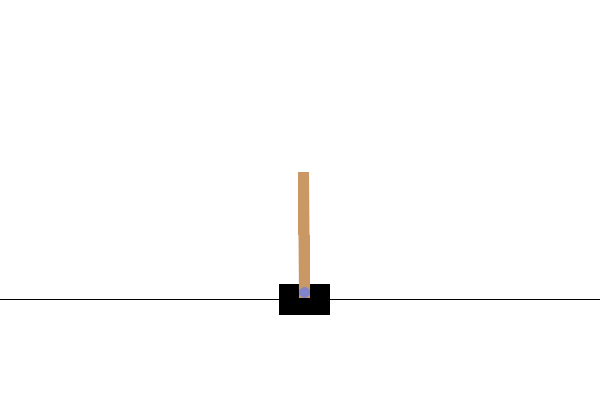

# Reinforcement-Learning

## Team Members:
    - Logan Liddiard
    - Kaden Hart
    - Arash Azizian Foumani
    

## Requirements:

    numpy
    torch
    gym
    imageio

These can be installed by running:
```
pip install nympy torch gym imageio
```

## Agent 1

Our average reward from this agent is 320.4. From the frist default iteration of the cartpole agent. We can see that it seems to the hang of balancing the pole.

However the cost of it doing so is that it does not keep the cart center on the screen. Ultimatley resulting in the cart drifting off screen. While the balancing behavior is something that should be rewarded, we shall correct this behavior in a custom environment.


<p align="center">
  
</p>
Attached is a demonstration of the carts drift behavior.


## Agent 2

Using the custom environment, the average reward after training increased to 442.5. By rewarding keeping the cart in the center along with keeping the pole upright, we can see dramatic improvements here. By adding this custom environment we were able to allow the agent to learn to stand up right longer. While it's drifting would theoretically work in an infinite space, our space here is not infinite. With this added behavior it is able to keep the pole balanced for much longer without hitting any walls.

<p align="center">
  
</p>
Attached is a demonstration of the carts stable behavior

## Agent 3

For this Agent we decided to increase the amount of layers it had. This yields us an average reward of 283.6.

While Agents 1 and 2 remained fairly consistent across numerous different trains, Agent 3 seemed to overcomplicate the problem by using different stategies. In the example below it almost seems as if it isn't finished training based on it's behavior. By adding more layers like we have, we have overcomplicated the model and made it training unstable.

<p align="center">
  
</p>
